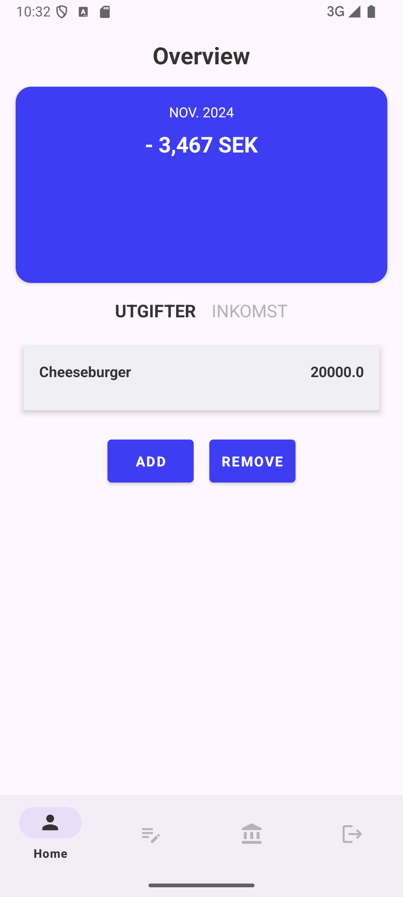
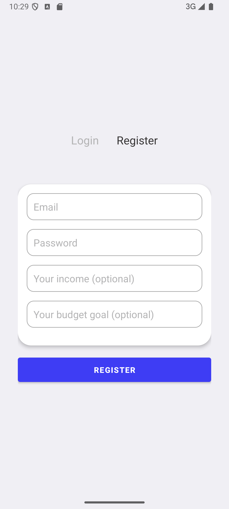
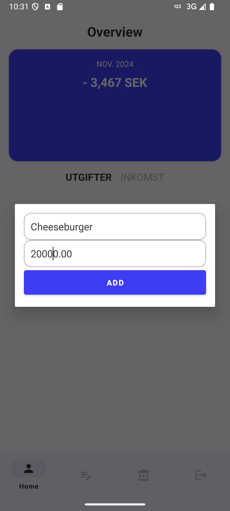

# Budget App

En Android-app där man säkert kan följa sitt spenderande och sätta upp sparandemål.
.png)

## Download
[Download the latest APK](https://github.com/AlexanderJson/Mobilt_Java23_Alexander_Jansson_API_intergration_v4/releases/tag/v1.0.0)


## Table of Contents

1. [Technologies](#technologies)
2. [Installation](#install-instructions)
3. [Features](#features)
4. [Architecture / Structure](#architecture--structure)
5. [Future Development](#future-development)
6. [Screenshots](#screenshots)


## Technologies
- **Android**: Kotlin
- **Backend**: Java Spring Boot
- **Database**: MySQL

## Install instructions
To use the app with the API and database, follow these steps:


1. Go to any folder.
2. In the address bar, type `cmd` and press **Enter**.
3. Clone the project:
   
```bash
git clone https://github.com/AlexanderJson/Mobilt_Java23_Alexander_Jansson_API_intergration_v4
```
#### Inside the folder is a SQL folder for database, API folder for API. 
### A local server environment is needed such as XAMPP etc. 


## Features
- **Register/Login**: Uses hashing and JWT tokens for security.
- **Add transactions**: Save transactions to the database.
- **View transactions**: Retrieve transactions from the database.

## Architecture / Structure
The app's structure is based on the following pattern:

- **API network** ➔ `api` class (HTTP requests) ➔ `repository` that returns HTTP results ➔ `service` class (additional logic) ➔ `viewmodels` for lifecycle management.
- Uses **Coroutines** and **LiveData** throughout.
- Secure data (like authentication tokens) is stored encrypted in `SharedPreferences`.
- **Data classes** are used to handle HTTP responses.

## Future Development
- **Delete transaction** (in progress).
- **Budget goals**: Users will be able to set and adjust budget goals.
- **Statistics and Notifications**: Display spending statistics in the app, with warning notifications.
- **Neural Network for predicting ideal deadlines & patterns in spending**: Use data from transactions & budget goals to calculate and find patterns in user activity for enchanced budget help.


## Screenshots

### Home Screen


### Login Screen
.png)

### Alternate Login View
.png)

### Registration Screen


### Add Transaction


### Alternate Add Transaction View
.png)
